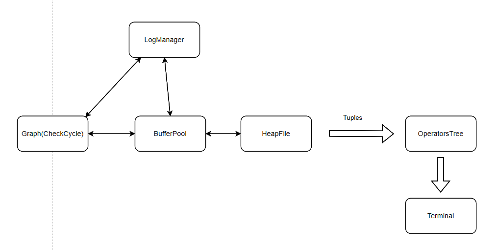
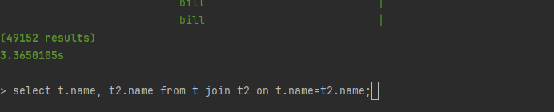
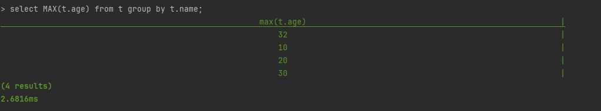
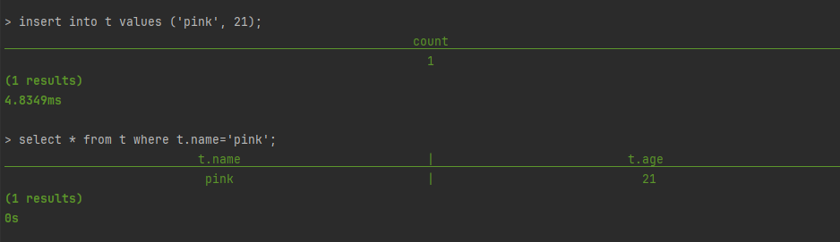

# Kangaroo 


[From mit-6.830](https://github.com/MIT-DB-Class/go-db-hw-2023)
用go实现的一个关系数据库

支持的一些功能
- [x] JOIN
- [x] PROJECTION
- [x] ORDER BY
- [x] LIMIT
- [x] GROUP BY
  - ~~having~~

# Installation 安装
``` 
> git clone https://github.com/Haibarapink/Kangaroo.git 
> cd Kangaroo
> go build main
> ./main
```

# Architecture 架构

# Implementation 实现
## Operator 算子
* *JOIN* 
  nested-join 算法
* *ORDER BY*
  一次取出所有的Tuple， 然后按照列的顺序排序
* *GROUP BY* 按照列来生成map，map的key是对应的group by的列的key，然后将相同的key的tuple保存在同一个数组里
，最后根据聚合函数来分组返回
## Transaction 事务
* Force/NoSteal机制，假设事务Commit写入磁盘不会失败。

*Force* Commit的时候必须将脏数据写入磁盘中。

*NoSteal* 脏数据不允许写入磁盘，BufferPool做页置换的时候，不将脏页淘汰即可。

* 死锁处理：DeadLock detection

如果事务持有pageA, 其他事务请求pageA失败，此时可以看作请求pageA事务有一条指向持有pageA事务的边。
依照这样的抽象，可以构成一个图，开启一个线程，每100ms检测图中是否存在环，如果存在，返回一个节点（事务ID），
将事务Abort掉。

# Examples





